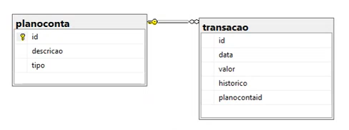

# myfinance-web-netcore
MyFinance - Projeto do curso de Pós-Graduação em Engenharia de Software da PUC-MG
O projeto foi desenvolvido para possibilitar o registro de receitas e despesas para realizar a análise dos gastos dos usuarios. 

# DER - Diagrama de Entidades e Relacionamento

# Tecnologias e estruturas de deploy utilizadas:
- ASP .NET MVC
-SQL Server
-Git
-VsCode
-.NET Core SDK
-SQL Server Express

# Executar projeto:
- Na pasta onde se encontra o projeto e o Git, acesse a pasta src
- Executar o comando dotnet run